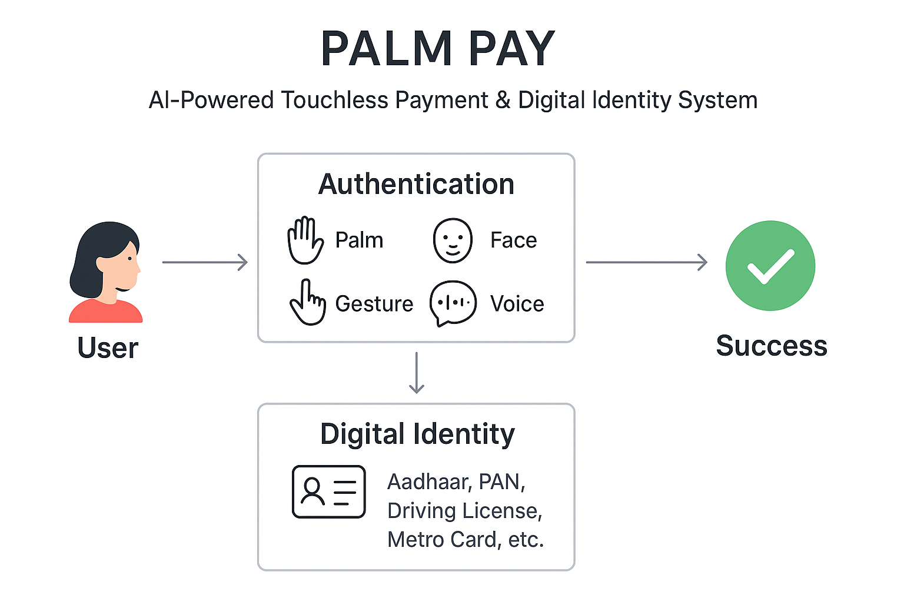

# 🌐 Palm Pay — AI-Powered Touchless Payment & Identity System

---

## 🚀 Overview

**Palm Pay** is a **secure, AI-driven, touchless payment and identity verification system** that works using **any standard camera** (webcam, smartphone, kiosk camera) without the need for expensive biometric scanners.  

It combines **multi-modal authentication** (Palm recognition + Face ID + Gesture PIN + Voice command) to complete payments or identity verification in **under 7 seconds**, making it one of the fastest and most user-friendly digital payment solutions.  

Unlike traditional systems, Palm Pay also doubles as a **Universal Digital ID Platform** — storing Aadhaar, PAN, Driving License, Metro cards, and other IDs in a **secure cardless format**, accessible through just your palm.  

Palm Pay isn’t just about payments — it integrates **safety, inclusivity, accessibility, and personalization**, making it a futuristic platform for both urban and rural use cases.

---

## ✨ Key Features

### 🔐 Security & Authentication
- **Multi-Modal Authentication:** Palm + Face + Gesture + Voice ensure layered security.
- **Adaptive Authentication:** Low-value transactions use palm only, while high-value transfers require multiple modalities.
- **Dynamic Gesture PINs:** Randomized challenges (e.g., “show 3 fingers”) to prevent spoofing.
- **Liveness Detection:** Detects blinking, hand movement, and voice tone to stop deepfakes or static image attacks.
- **Context-Aware Security:** Payment system adapts based on environment (public place vs. personal device).

### 💳 Payment & Identity
- **Palm-as-QR:** Show palm instead of scanning a QR code.
- **Voice-Powered Transactions:** Say “Pay 200 to Neha” and confirm with a gesture.
- **Offline Mode (Edge AI):** Small-value transactions can happen without internet and sync later.
- **Universal Digital ID:** Store Aadhaar, PAN, Metro card, driving license, etc. (DigiLocker-style integration).
- **Contactless Access Control:** Unlock smart locks, metro gates, and offices with palm.

### 🆘 Emergency & Accessibility
- **Emergency SOS Mode:** Special palm gesture sends live location and SOS alert to trusted contacts.
- **Indian Sign Language Support:** Inclusive payments for hearing-impaired users.
- **Multi-Language Voice Commands:** Supports Hindi, English, and more for rural accessibility.

### 🎉 Personalization & Engagement
- **Fun Mode:** Palm reading, astrology predictions, and seasonal greetings.
- **Gamification:** Earn loyalty points, cashback, or badges for frequent usage.
- **Wearable Integration:** Pair with smartwatches or AR glasses for an extra identity layer.

---

## 🛠️ Tech Stack

### 🎨 Frontend
- **Framework:** React.js / Next.js  
- **Styling:** TailwindCSS + Framer Motion (for smooth animations)  
- **Camera Processing:** TensorFlow.js + MediaPipe Hands (runs directly in browser)  

### ⚙️ Backend
- **Framework:** FastAPI (Python) or Node.js + Express  
- **Database:** SQLite (local dev) → PostgreSQL (production via Supabase/Render)  
- **APIs:** DigiLocker API for identity docs (optional), Web Speech API for browser-based voice  

### 🤖 AI & Machine Learning
- **Palm + Gesture Recognition:** MediaPipe Hands, TensorFlow.js  
- **Face Recognition:** face-api.js (browser) or DeepFace (Python backend)  
- **Voice Recognition:** Vosk API (offline STT), Web SpeechRecognition API  
- **Text-to-Speech:** Mozilla TTS / Browser SpeechSynthesis  
- **Fraud Detection:** Unusual spending pattern detection using ML models  

### ☁️ Hosting
- **Frontend:** GitHub Pages / Netlify  
- **Backend:** Render / Railway (free tier)  
- **Database:** Supabase (PostgreSQL cloud)  

---

## 📂 Project Structure

```
PalmPay/
│── backend/
│   ├── app.py                # FastAPI server
│   ├── database.sqlite       # Local database (switchable to PostgreSQL)
│   └── models/               # DB Models: User, Transaction, Documents
│
│── frontend/
│   ├── index.html            # Landing page
│   ├── app.js                # React logic
│   ├── palm.js               # Palm + gesture recognition
│   ├── face.js               # Face recognition
│   ├── voice.js              # Speech-to-text + TTS
│   └── styles.css            # Tailwind / custom styles
│
│── models/
│   ├── palm_model.tflite     # TensorFlow palm recognition model
│   └── gesture_model.tflite  # Gesture PIN model
│
│── docs/
│   ├── README.md             # Documentation
│   └── demo_flow.png         # Flow diagram of payment system
│
└── tests/
    ├── test_auth.py          # Test authentication modules
    ├── test_payment.py       # Test payment flow
    └── test_sos.py           # Test emergency SOS module

```
---

## 🔧 Installation & Usage

### 1. Clone the Repository
```
git clone https://github.com/username/palmpay.git
cd palmpay
```
### 2. Setup Backend (FastAPI)
```
cd backend
pip install -r requirements.txt
uvicorn app:app --reload
```
### 3. Setup Frontend (React)
```
cd frontend
npm install
npm start
```
### 4. Open in Browser

Visit:

http://localhost:3000


---

## 📊 Constraints & Design Choices

Must work on regular cameras (no infrared/palm-vein scanners).

7-second rule: Authentication + Payment must finish in under 7s.

No central biometric storage — only device-level encryption and federated learning.

Free & Open-Source Tools First: All major AI components run with free libraries/APIs.


---

## 🌍 Real-World Impact & Contest Value

Financial Inclusion: Works in rural areas with low-cost smartphones.

Accessibility: Sign language + multilingual support = inclusive for all.

Privacy First: No raw biometric stored on servers.

Emergency Safety: SOS gesture helps in real-world danger scenarios.

Beyond Payments: Functions as a universal digital ID and contactless access system.


Palm Pay isn’t just a payment app — it’s a platform that merges security, identity, inclusivity, and personalization into one AI-driven ecosystem.


## 🏆 Why Palm Pay Can Win AI Contests

Innovation: A first-of-its-kind multi-modal palm + voice + gesture payment system.

Social Impact: Safe, inclusive, and useful in both urban and rural areas.

Scalability: Works with free AI libraries and existing devices (no hardware investment).

Fun + Serious Use: From secure UPI payments to AI palm reading and greetings.

Future-Ready: Integrates with wearables, AR glasses, and IoT.


---

## 📸 Demo Flow



1. User shows palm → Palm Pay recognizes and fetches ID/payment profile.

2. User says “Pay 100 to Amit” (voice input).

3. Palm Pay asks for gesture PIN → e.g., “show 2 fingers”.

4. User shows gesture → system verifies liveness (movement/angle).

5. Payment confirmed ✅ within 7 seconds.


## ✅ Future Roadmap

🔹 Blockchain-based audit trails for transaction security.

🔹 AI-driven fraud scoring for unusual transactions.

🔹 Federated Learning on devices for private model training.

🔹 Wearable + IoT integration (smart locks, metro gates).

🔹 Global ID standardization with palm + digital wallet.


